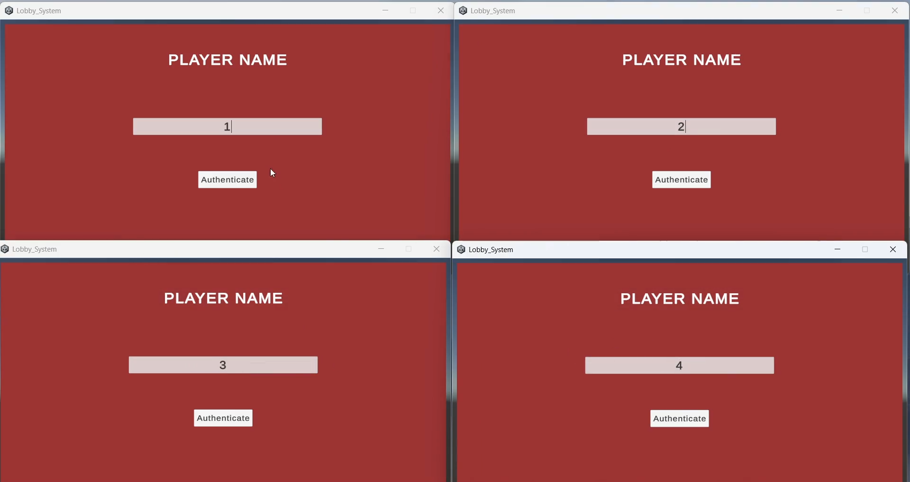
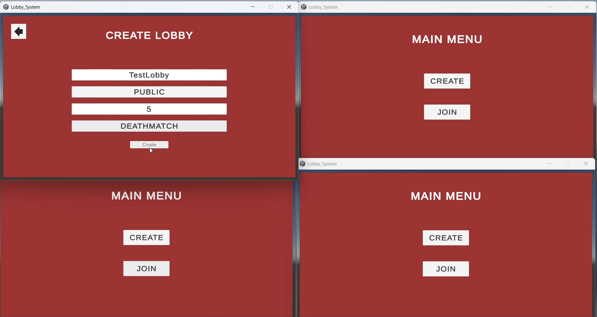
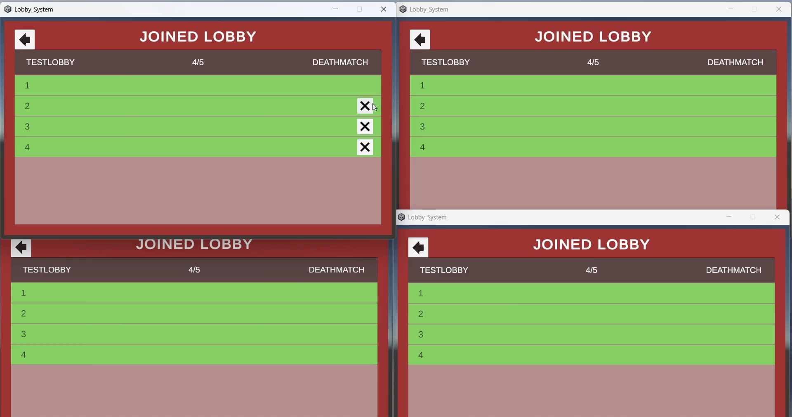
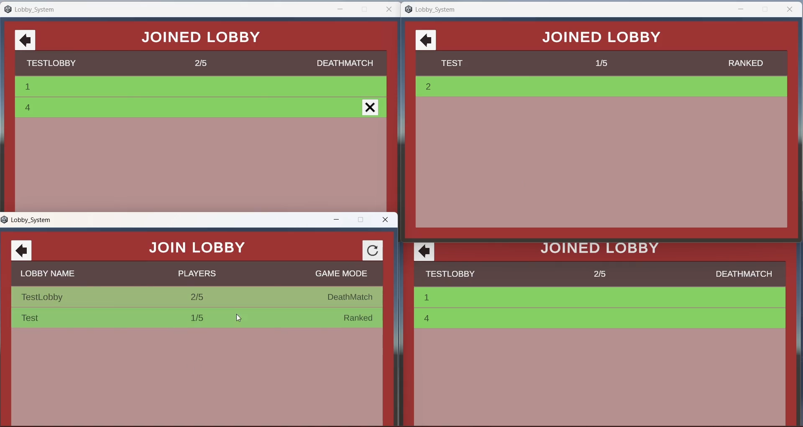

# 🎮 Unity Multiplayer Lobby System  
**Unity 6.3 LTS | Netcode for GameObjects**

A robust and scalable multiplayer Lobby System built using **Unity 6.3 LTS** and **Netcode for GameObjects**, designed to properly handle real-world multiplayer edge cases - especially **host disconnections**.

Most multiplayer demos focus only on the “happy path”:

Host → Players Join → Start Game  

This project focuses on what happens when things go wrong.

---

## 🚀 Features

- ✅ Host / Client architecture  
- ✅ Player authentication before joining  
- ✅ Heartbeat system to keep lobby active  
- ✅ Event-based modular architecture  
- ✅ Automatic host migration when the host disconnects  
- ✅ Host-only kick system  
- ✅ Proper server authority handling  

---

## 🛠 Built With

- Unity 6.3 LTS  
- Netcode for GameObjects   
- C#  

---

## 🧠 Architecture Approach

This system follows a **server-authoritative design**.

Flow:

Client Action  
↓  
Server Validates Authority  
↓  
NetworkVariable State Update  
↓  
Automatic Sync to All Clients  

This approach keeps the system clean, scalable, and easier to maintain.

---

## 💡 Key Learning

Multiplayer isn’t about syncing objects.

It’s about:

- Handling host disconnects  
- Designing for edge cases  
- Managing authority correctly  
- Building resilient systems  

Now, even if the host leaves, the lobby continues seamlessly.

---

## 🎯 Purpose

This project was built to deeply understand:

- Multiplayer architecture design  
- Authority handling in Netcode  
- Event-driven system structure  
- Failure-safe lobby systems  

---

## 📝 Screenshots

---

---

---

---
